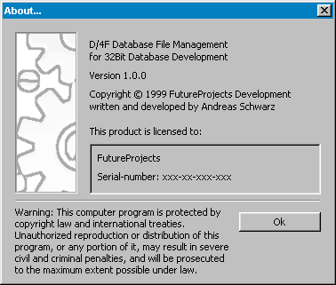



## how to make a AboutBox\.

### Description

Look out, this is a really professional AboutBox. Really USEABLE !!! including all formatings like version and Application Title.
 
### More Info
 

             |
---                |---
**Submitted On**   |2000-01-07 01:41:28
**By**             |[Andreas Schwarz](https://github.com/Planet-Source-Code/PSCIndex/blob/master/ByAuthor/andreas-schwarz.md)
**Level**          |Beginner
**User Rating**    |4.3 (13 globes from 3 users)
**Compatibility**  |VB 4\.0 \(32\-bit\), VB 5\.0, VB 6\.0
**Category**       |[Custom Controls/ Forms/  Menus](https://github.com/Planet-Source-Code/PSCIndex/blob/master/ByCategory/custom-controls-forms-menus__1-4.md)
**World**          |[Visual Basic](https://github.com/Planet-Source-Code/PSCIndex/blob/master/ByWorld/visual-basic.md)
**Archive File**   |[CODE\_UPLOAD51094232000\.zip](https://github.com/Planet-Source-Code/andreas-schwarz-how-to-make-a-aboutbox__1-7513/archive/master.zip)

